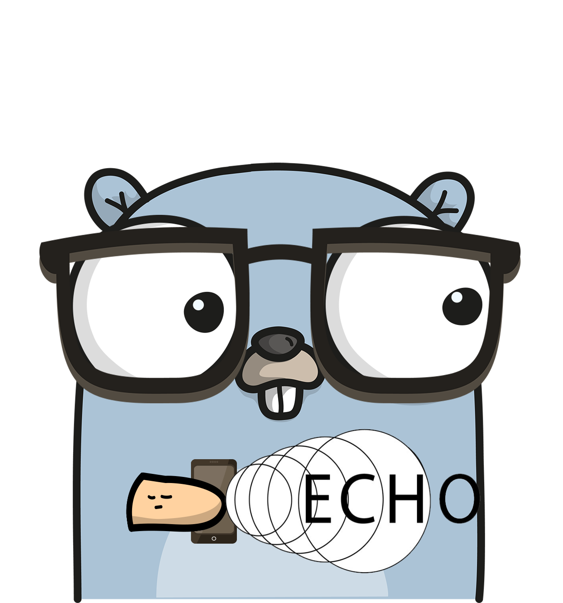

  
  <h1 align="center">
    TCP Echo Server
     
    
    
    
  </h1>

Asynchronous TCP server implementing [Echo Protocol](https://datatracker.ietf.org/doc/html/rfc862)

## Features
- One goroutine handles one connection.
- Gracefully stopping the server and closing all active connections.
- Ability to write and use custom MessageHandler instead of EchoHandler.

## Build and run
- `docker-compose up`

## Connect
#### Windows
- `telnet 127.0.0.1 7`
